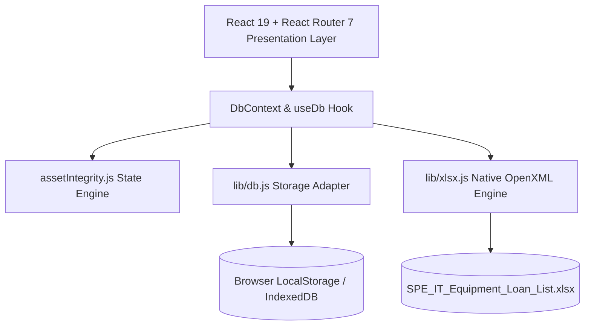
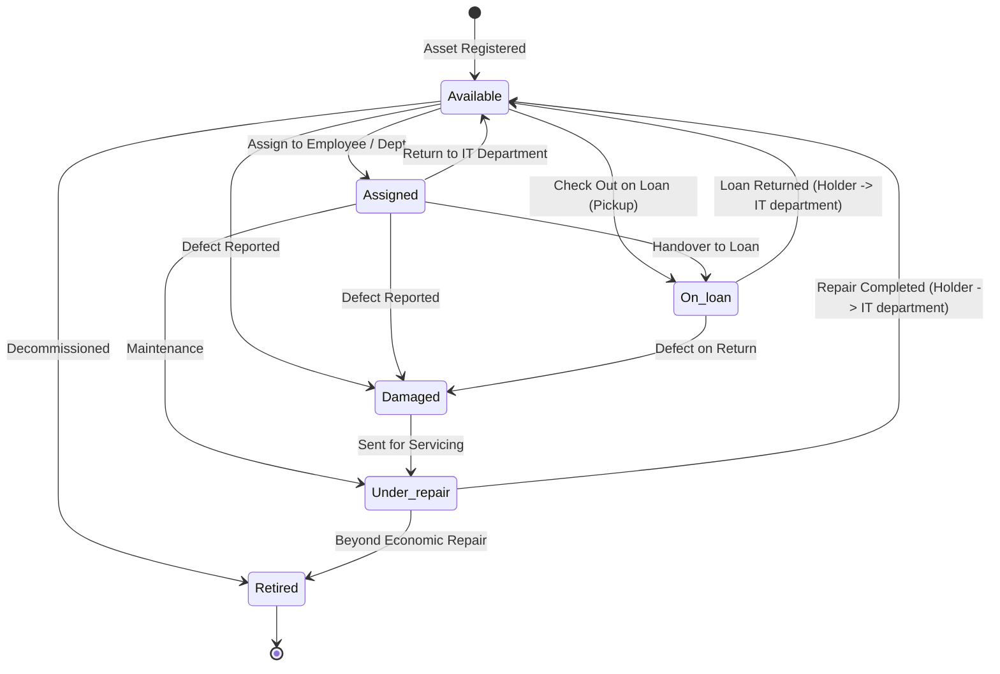

# StarPlus Energy Asset Management System — Software Design Document (SDD)

| Metadata | Details |
| :--- | :--- |
| **Document Version** | **v1.2.1** |
| **System Name** | StarPlus Energy Asset Management System (SPE-AMS) |
| **Document Status** | Approved / Production Specification |
| **Release Date** | October 2026 |
| **Target Environment** | 100% Air-Gapped Offline Corporate Intranet / Local Workstation |
| **Tech Stack** | React 19, Vite 6, React Router 7, Vanilla CSS Design Tokens, Client-side OpenXML |
| **Related Documents** | [Technical Specification.md](file:///c:/Users/Developer/Documents/workspace/Inventory-Management-Software/Technical%20Specification.md), [PATCH_NOTES.md](file:///c:/Users/Developer/Documents/workspace/Inventory-Management-Software/PATCH_NOTES.md) |

---

## 1. Executive Summary & Document Purpose

The **StarPlus Energy Asset Management System (SPE-AMS)** is a high-reliability, air-gapped internal inventory and custody management web application designed for StarPlus Energy IT operations. 

The application serves as the **single source of truth** for company hardware (laptops, monitors, peripherals, and network accessories), replacing ad-hoc spreadsheets while maintaining 100% bidirectional data interoperability with corporate Excel workbooks (`.xlsx`).

### Core Business Pillars
1. **Asset as Master Record**: Every physical device carries a unique asset code (`SPE-XXXX` or serial number) that remains perpetual regardless of reassignments, temporary loans, maintenance cycles, or returns.
2. **100% Air-Gapped Offline Operation**: Zero dependencies on external networks, cloud APIs, remote CDNs, or external typography services (Google Fonts). All assets, styling, and data storage operate strictly within the local environment.
3. **Deterministic State Lifecycle & Passive Sync**: A strict state machine enforces valid operational states (`Available`, `Assigned`, `On loan`, `Damaged`, `Under repair`, `Retired`) supported by a non-intrusive background verification engine that actively reconciles custody states.
4. **Unified Custody & Return Lineage**: Full chronological tracking of ownership transfers. When an asset is returned from custody, it is formally received by the **IT department**, returning its status to **Available** while preserving its prior holder lineage.

---

## 2. Brand Identity & Design System

The application incorporates the formal StarPlus Energy corporate brand guidelines:

### 2.1 Corporate Palette

| Role | Color Name | Hex Code | Usage |
| :--- | :--- | :--- | :--- |
| **Primary** | Corporate Blue | `#1449d6` | Key actions, active states, brand mark, active navigation |
| **Primary Dark** | Deep Navy | `#0a2547` | Headings, brand contrast accents |
| **Primary Light** | Soft Blue Tint | `#eef4ff` | Badges, selection highlights, version pill |
| **Background** | Clean Neutral | `#f8fafc` | Main application shell background |
| **Surface** | Pure White | `#ffffff` | Content panels, cards, data tables, modals |
| **Borders** | Slate Line | `#e2e8f0` | Dividers, card boundaries, table cell borders |
| **Typography** | Slate Ink | `#141519` | High-contrast body text and titles |
| **Muted Ink** | Slate Gray | `#64748b` | Subtitles, labels, metadata, secondary icons |
| **Success** | Emerald | `#10b981` | Available status, healthy indicators, offline status dot |
| **Warning** | Amber | `#f59e0b` | On loan badges, scheduled loans |
| **Danger** | Crimson | `#ef4444` | Damaged assets, overdue loan alerts, destructive actions |

### 2.2 Corporate Mark & Typography
- **Geometric Hexagon SVG Mark**: Custom inline vector hexagon glyph representing StarPlus Energy's battery and clean energy engineering identity.
- **Air-Gapped Typography Stack**: Native system font stack (`-apple-system, BlinkMacSystemFont, "Segoe UI", Roboto, Oxygen, Ubuntu, Cantarell, "Helvetica Neue", Arial, sans-serif`). Zero external network requests to Google Fonts or Typekit, guaranteeing consistent, instantaneous rendering in offline and intranet environments.
- **High-Density Compact Layout**: An ultra-compact topbar (~32px height) eliminating wasted vertical space and maximizing the viewable area for large asset tables and inventory grids. Redundant greeting banners have been eliminated in favor of a clean enterprise header.

---

## 3. Technology Stack & Architecture



| Layer | Component | Specification | Rationale |
| :--- | :--- | :--- | :--- |
| **Framework** | React 19 (`react: ^19.0.0`) | Modern component model, hooks, concurrent rendering | Fast client-side rendering with zero server runtime overhead |
| **Bundler** | Vite 6 (`vite: ^6.0.0`) | Lightning-fast HMR and optimized production bundle | Fast local compilation without complex build tooling |
| **Routing** | React Router 7 (`react-router-dom: ^7.0.0`) | SPA client-side route handling | Instant view switching across Overview, Assets, Loans, Directory, Exchange |
| **Styling** | Vanilla CSS Design Tokens | Native CSS variables, zero runtime CSS-in-JS | Complete layout flexibility, no Tailwind dependencies, 100% offline |
| **Data Engine** | Local Storage Adapter | IndexedDB / LocalStorage with schema migrations | Zero database installation requirement on field workstations |
| **Spreadsheet Engine** | Pure JS OpenXML Engine | Native ZIP/DEFLATE OpenXML parser & generator | 1:1 workbook compatibility with zero third-party cloud or npm binary dependencies |

---

## 4. States Version & State Machine Specification (v1.0.0)

### 4.1 Asset States Definition (States Schema v1.0.0)

The system recognizes exactly six mutually exclusive operational states for all hardware items:

| Status | Code | Description | Permitted Current Holder |
| :--- | :--- | :--- | :--- |
| **Available** | `Available` | Asset is in storage/fleet, tested, and ready for immediate deployment or checkout. | Strictly `IT department` or Unassigned (`""`) |
| **Assigned** | `Assigned` | Asset is assigned to a specific employee or department for day-to-day work duties. | Must be a named employee or department |
| **On loan** | `On loan` | Asset is out on active temporary custody under a formal loan agreement. | Must match the active loan's `assignee` |
| **Damaged** | `Damaged` | Asset has reported physical or functional defects; held for evaluation. | `IT department` or reporting employee |
| **Under repair** | `Under repair` | Asset is actively undergoing internal repair or external vendor service. | `IT department` or Vendor |
| **Retired** | `Retired` | Asset decommissioned, disposed of, or parted out; retained for audit history. | Decommissioned archive |

### 4.2 State Transition Diagram



### 4.3 State Invariants & Business Transition Rules

1. **Active Holder Invariant**:
   - If an asset has an assigned employee or department holder (`owner != ''` and `owner != 'IT department'`), its status **cannot** be `Available`. The system automatically normalizes the status to `Assigned` (or `On loan` if tied to an active checkout).
   - If an asset is marked `Available`, its holder is normalized to `IT department` (or empty).
2. **Return to IT Department Workflow**:
   - When any asset is returned from an assignment or loan checkout:
     - The holder is explicitly set to **`IT department`**.
     - The status transitions to **`Available`** (unless flagged as damaged).
     - An immutable entry is appended to the asset's `ownershipHistory`, recording the previous borrower as `previousOwner`, `IT department` as `newOwner`, the return timestamp, and the reason `"Returned to IT department"`.
3. **Passive Verification & Sync Service**:
   - Rather than requiring manual administrative triggers, a passive background integrity service runs automatically during database initialization and state mutations.
   - It continuously reconciles loan records against the asset register:
     - If an active loan is picked up and unreturned, the asset status is enforced as `On loan`, and its location and holder reflect the loan record.
     - When all loans for an asset are returned, the asset is automatically freed from `On loan` status and restored to `Available` held by `IT department`.
     - Normalizes legacy references (e.g. `"pool"`, `"returned to pool"`) directly to `"IT department"`.
4. **Direct Ownership Transfer**:
   - Clicking on any holder badge in the Assets table directly launches the **Change Ownership Modal**, eliminating the need for a redundant "Actions" column in the table layout.
   - Provides selectable standardized reasons (*"Reassigned to new staff"*, *"New Hire onboarding"*, *"Department Transfer"*, *"Returned to IT department"*, *"Temporary Handover"*, *"Repaired & Reassigned"*) alongside custom entry.

---

## 5. Unified Ownership History Architecture

Every asset maintains a nested, chronological `ownershipHistory` array:

```json
{
  "id": "e9f1a234-8c90-4e2b-a132-7589d6b45a90",
  "code": "SPE-1002",
  "name": "ThinkPad T14s Gen 3",
  "category": "Laptop",
  "owner": "IT department",
  "department": "",
  "status": "Available",
  "location": "HQ - Storage Room 2B",
  "updated": "2026-10-07",
  "ownershipHistory": [
    {
      "id": "hist-101",
      "date": "2026-10-07 14:15:00",
      "previousOwner": "Sarah Connor",
      "newOwner": "IT department",
      "reason": "Returned to IT department",
      "notes": "Project completed, clean condition"
    },
    {
      "id": "hist-100",
      "date": "2026-03-15 09:00:00",
      "previousOwner": "IT department",
      "newOwner": "Sarah Connor",
      "reason": "Department Transfer",
      "notes": "Engineering allocation"
    }
  ]
}
```

The system dynamically merges permanent assignments with internal loan checkout/return events via `getAssetEffectiveOwnershipHistory()`, ensuring an unbroken audit trail from initial registration to decommissioning.

---

## 6. Data Exchange Engine (TXT Import & 1:1 Excel Export)

To maximize interoperability with corporate spreadsheet workflows, the application standardizes on tab-delimited text (`.txt`) imports extracted directly from Excel, while preserving exact 1:1 OpenXML `.xlsx` exports.

### 6.1 Supported Import Formats (TXT Extracted from Excel)
The client-side parser (`src/lib/txtImport.js`) runs 100% offline and automatically recognizes:
1. **Equipment Inventory Master (`SPE_Equipments_example.txt`)**:
   - `Host Name` (Asset code), `Serial Number`, `Status`, `Issued Knox ID`, `Issued Date`.
   - Automatically maps statuses (`Issued` ➔ `Assigned`, `Broken` ➔ `Damaged`, `Available` ➔ `Available`).
2. **IT Equipment Loan List (`SPE_IT_Equipment_Loan_List_Example.txt`)**:
   - `Start Date`, `Pickup Date`, `End Date`, `Return Date`, `Laptop`, itemized accessories (`Adapter`, `Cable`, `Dongle`, `Keyboard`, `Mouse`, `Monitor`, `Ethernet cable`), and notes.
   - Accurately parses multiline quoted fields (e.g. `"Charging \r\nAdapter"`), BOM marks, and normalizes Excel null dates (`1/0/1900`).
   - Automatically correlates laptop asset codes with equipment holder records to ensure borrower identities remain consistent.
3. **Batch Multi-File Ingestion**:
   - Allows administrators to upload both files in tandem; the engine cross-references equipment serials and active loans before writing to local storage.

### 6.2 1:1 Reference Excel Exports
Export functionality continues to generate native OpenXML `.xlsx` workbooks:
- `SPE_IT_Equipment_Loan_List_YYYY-MM-DD.xlsx` with exact 1:1 column parity matching the corporate loan register.
- `SPE_Equipments_YYYY-MM-DD.xlsx` matching the equipment master structure.

### 6.3 Pre-Import Snapshot & One-Click Revert
Prior to importing external text files that modify the active database, the system automatically saves a serialized snapshot of the local database to `IMPORT_BACKUP_KEY`. If an accidental or malformed import occurs, the user can click **"Revert last import"** on the Data Exchange view to instantly restore the previous dataset.

---

## 7. User Interface Layout & Views

The frontend application provides six core operational views accessed via the left navigation sidebar:

1. **Operations Dashboard (`/`)**:
   - High-level KPI stat cards (Total Fleet, Available for Deployment, In Active Custody, Under Maintenance/Repair, Overdue Loans).
   - Category distribution bar chart with count breakdowns.
   - Interactive quick-filtered asset view (Recently updated, Available, Assigned, Needs Attention).
2. **Asset Register (`/assets`)**:
   - Complete inventory data grid with multi-column filtering (Status, Category, Location, Search term across all fields).
   - Batch selection with bulk status updates and bulk deletion.
   - Interactive holder badges: clicking an owner opens the **Change Ownership Modal** directly.
3. **Loans & Custody (`/loans`)**:
   - Active, Scheduled, Overdue, and Returned custody management.
   - One-click **"Confirm Pickup"** and **"Return Asset"** workflows.
   - Equipment accessory checklist tracking.
4. **Business Travelers (`/business-travelers`)**:
   - Dedicated mobile workforce custody and field deployment management (accessible via `/business-travelers` with automatic `/travelers` redirection).
   - **Exclusive Calendar View Mode**: Operators selecting **"Calendar View"** see solely the monthly schedule calendar (`TravelerCalendar.jsx`), omitting KPI stat cards and location panels for an uncluttered planning experience.
   - **"How Many They Are"**: Real-time KPI statistics tracking active in-field deployments, total distinct travelers, scheduled pickups, overdue loans, and active locations.
   - **"Where They Are"**: Interactive location distribution grid grouping travelers by deployment facility (Kokomo Plant, Regional Office, Detroit Center, Head Office) with one-click filtering.
   - **Full-Screen Full-Body Roster Mode**: 1-click toggle expanding the complete mobile workforce roster across the viewport with sticky column headers and Escape key exit.
   - **Mobile Workforce Roster**: Searchable, filterable table detailing traveler names, Knox IDs, deployed hardware/IP, assignment duration, and countdown badges.
   - **Integrated Workflows**: Direct Return confirmation returning hardware to IT department, trip editor, and new business traveler dispatch recording.
5. **Directory (`/directory`)**:
   - Personnel directory with Knox IDs, departments, and active equipment counts.
   - Department directory and rental facility locations.
6. **Data Exchange (`/exchange`)**:
   - Tab-delimited text (`.txt`) import extracted from Excel (`SPE_Equipments_example.txt` & `SPE_IT_Equipment_Loan_List_Example.txt`).
   - Interactive preview modal with pre-flight record validation and Merge vs Replace options.
   - Reference-format `.xlsx` OpenXML export maintaining 1:1 column parity.
   - Snapshot restore point management.
7. **Patch History & Release Notes (`PatchHistoryModal.jsx` & `PatchHistoryPage.jsx`)**:
   - In-app release notes viewer accessible via the TopBar version pill (`v1.2.1 • Patch Notes`), the Sidebar footer, or the dedicated `/patch-history` and `/changelog` routes.
   - Pinned modal header and filter controls with internal single-scroll stream (`.patch-cards-stream`), preventing clipped headers and double scrollbars.
   - Per-version tabbed navigation, real-time keyword search, change type filtering (`All Types`, `Patches`, `Minor`, `Major`), and structured release highlights.

---

## 8. Non-Functional Guarantees

| Requirement | Implementation & Standard |
| :--- | :--- |
| **Air-Gap Compliance** | 100% offline. No telemetry, no external CSS/JS CDNs, no Google Fonts, no remote analytics. |
| **Performance** | Instantaneous search and filter response (< 50ms) via in-memory React state indexing. |
| **Compatibility** | Tested on Chromium (Edge, Chrome) and Firefox across Windows 10/11 enterprise workstations. |
| **Data Safety** | Synchronous localStorage persistence with error handling and import restore points. |
| **Zero Setup** | Single production artifact (`dist/`) or local dev server (`npm run dev`) with zero native daemon requirements. |

---

## 9. Version Control & History

- **v1.2.1** *(Exclusive Calendar Focus View, Frontend Patch History & Versioning Calibration)*:
  - Added exclusive Calendar View mode on `/business-travelers` hiding KPI cards and location breakdown blocks to display only the monthly schedule calendar.
  - Implemented in-app Patch History Modal (`PatchHistoryModal.jsx`) and dataset (`src/data/patchHistory.js`) triggered via TopBar, sticky bottom-left Sidebar footer pill (`v1.2.1 • Patch Notes`), and direct button in the Business Travelers header.
  - Made sidebar sticky (`position: sticky; top: 0; height: 100vh`) ensuring the bottom-left version info is permanently pinned in view on tall pages.
  - Resolved modal clipping, horizontal blowout, and card flex-shrink compression (`flex-shrink: 0; min-height: min-content`) ensuring patch history renders full release notes and scrolls smoothly without squishing.
  - Calibrated Semantic Versioning policy to restrained patch increments (`1.2.x`) for UI refinements, bug fixes, and documentation synchronizations.
  - Updated all technical and design documentation.
- **v1.2.0** *(TXT Import Extracted from Excel & 1:1 Excel Export)*:
  - Standardized on tab-delimited `.txt` import format for Equipment Inventory (`SPE_Equipments_example.txt`) and IT Loan Lists (`SPE_IT_Equipment_Loan_List_Example.txt`).
  - Added multiline quoted field parser and automatic header format detection (`src/lib/txtImport.js`).
  - Interactive import preview modal with Merge & Sync vs Full Replace modes.
  - Preserved 1:1 OpenXML `.xlsx` exports for both loans and equipment masters.
- **v1.1.1** *(Full Screen Roster Mode & Specific URL Routing)*:
  - Upgraded route from `/travelers` to specific `/business-travelers` with backward-compatible redirect.
  - Added 1-click Full Screen Roster mode (`roster-fullscreen`) with full-body viewport layout, sticky table headers, and Escape key dismissal.
  - Migrated component to `BusinessTravelersPage.jsx`.
- **v1.1.0** *(Business Travelers Management & Location Matrix)*:
  - Dedicated Business Travelers management view (`/travelers`) with real-time active field badge in the sidebar.
  - "How many they are": KPI counters for active in field, travel locations, scheduled trips, and total unique travelers.
  - "Where they are": Interactive location distribution matrix grouping travelers by destination/plant with one-click filtering.
  - Integrated mobile workforce roster with countdown badges, trip editing, and return-to-IT workflow.
- **v1.0.0** *(Official Production Baseline)*:
  - Production architecture in React 19 + Vite 6 + React Router 7.
  - StarPlus Energy corporate design language (Blue `#1449d6`, Navy `#0a2547`, Slate `#141519`, geometric SVG logo).
  - High-density compact topbar (~32px) and scroll-free 4-column compact modal forms.
  - States Version 1.0.0 state machine and continuous passive verification & sync engine.
  - Return to IT department workflow with unbroken ownership history.
  - Direct holder click-to-transfer modal with custom transfer reasons.
  - 100% offline air-gapped system font stack (zero external Google Fonts / CDNs).
  - 1:1 Excel column header preservation and rollback engine.
