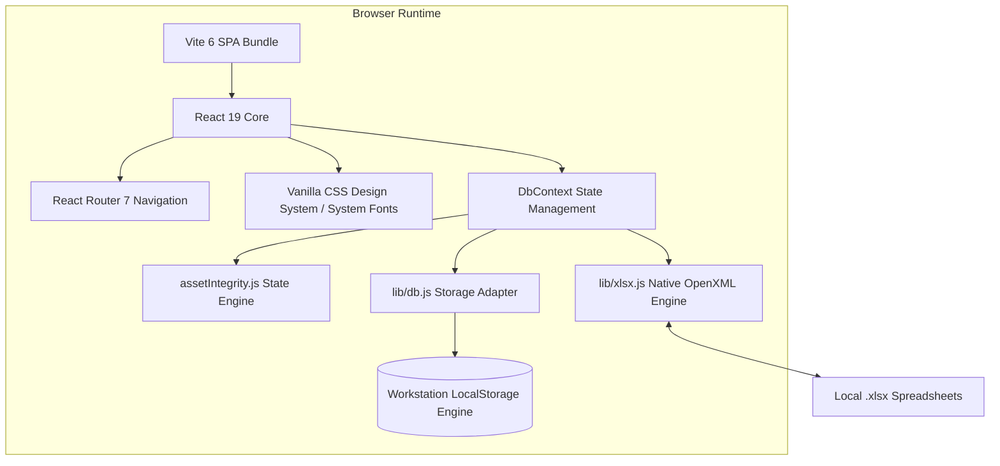
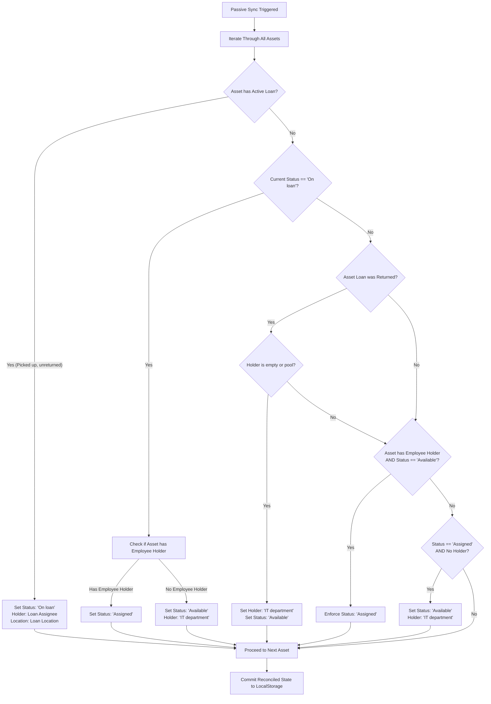

# StarPlus Energy Asset Management System — Technical Specification

| Metadata | Details |
| :--- | :--- |
| **Specification Version** | **v1.2.1** |
| **System Name** | StarPlus Energy Asset Management System (SPE-AMS) |
| **Specification Status** | Approved / Production Architecture |
| **Release Date** | October 2026 |
| **Target Runtime** | Chromium 100+, Firefox 100+, Safari 16+ (Air-Gapped Offline / Intranet) |
| **Source Repository** | [Inventory-Management-Software](file:///c:/Users/Developer/Documents/workspace/Inventory-Management-Software) |
| **Related Documents** | [Software Design Document.md](file:///c:/Users/Developer/Documents/workspace/Inventory-Management-Software/Software%20Design%20Document.md), [PATCH_NOTES.md](file:///c:/Users/Developer/Documents/workspace/Inventory-Management-Software/PATCH_NOTES.md) |

---

## 1. Technology Stack Architecture

The system is engineered as an **offline-first, zero-telemetry Single Page Application (SPA)** capable of running autonomously without an internet connection, application server daemon, or relational database service.



### 1.1 Stack Specification

| Tier | Technology | Version | Purpose & Rationale |
| :--- | :--- | :--- | :--- |
| **UI Library** | **React** | `^19.0.0` | Declarative UI rendering, modern hooks (`useCallback`, `useMemo`, `useTransition`), concurrent rendering safety. |
| **DOM Renderer** | **React DOM** | `^19.0.0` | Client-side DOM mounting and tree reconciliation. |
| **Build Tooling** | **Vite** | `^6.0.0` | Sub-second cold starts, instant Hot Module Replacement (HMR), tree-shaken static production bundling. |
| **Vite Plugin** | **@vitejs/plugin-react** | `^4.3.0` | Fast Refresh transform pipeline. |
| **Client Routing** | **React Router** | `^7.0.0` | Lightweight declarative SPA routing (`BrowserRouter`, `Routes`, `Route`, `useNavigate`, `useLocation`). |
| **Styling** | **Vanilla CSS** | Standard CSS3 | CSS Custom Properties (`--blue: #1449d6`, `--ink: #141519`, etc.), responsive flexbox/grid. No Tailwind runtime or precompiler dependencies. |
| **Typography** | **System Font Stack** | Native OS | `-apple-system, BlinkMacSystemFont, "Segoe UI", Roboto...` ensuring 100% offline air-gapped rendering without remote font downloads. |
| **Persistence** | **LocalStorage Engine** | Web Storage API | Synchronous, zero-setup local persistence with automated transactional JSON serialization and backup restore points. |
| **Spreadsheet Engine** | **Native OpenXML** | Custom ES Module | Zero-dependency pure JavaScript `.xlsx` parser/generator utilizing raw ZIP/DEFLATE OpenXML structures. |

---

## 2. Component Architecture & Directory Structure

```
Inventory-Management-Software/
├── index.html                   # HTML entry point (clean system typography, zero CDNs)
├── package.json                 # Project manifest (v1.2.1, scripts, dependencies)
├── vite.config.js               # Vite 6 configuration with React plugin
├── src/
│   ├── main.jsx                 # Application entry point, mounts AppShell inside BrowserRouter
│   ├── App.jsx                  # Top-level route switch & context providers
│   ├── index.css                # StarPlus Energy design system, tokens, and utility classes
│   ├── components/
│   │   ├── AppShell.jsx         # Global layout shell (Sidebar + Main panel + PatchHistoryModal + Toast)
│   │   ├── Sidebar.jsx          # Collapsible navigation, hexagon SVG brand mark, clickable version indicator
│   │   ├── TopBar.jsx           # High-density ~32px header, title, clickable version pill, offline indicator
│   │   ├── PatchHistoryModal.jsx# In-app release notes viewer per version with search & filtering
│   │   ├── TravelerCalendar.jsx # Monthly schedule calendar with location filtering & day inspection
│   │   ├── Modal.jsx            # Accessible overlay modal dialog with backdrop dismiss
│   │   ├── AssetTable.jsx       # Interactive data grid, batch checkboxes, click-to-transfer badges
│   │   ├── AssetForm.jsx        # Asset registration and editing modal form
│   │   ├── ChangeOwnerModal.jsx # Direct ownership transfer dialog with custom reasons
│   │   ├── LoanForm.jsx         # Internal loan checkout form with equipment checklist
│   │   ├── StatCard.jsx         # High-level KPI metric card with icon & status styling
│   │   ├── BarChart.jsx         # Category distribution chart
│   │   └── Toast.jsx            # Non-blocking feedback notification toast
│   ├── pages/
│   │   ├── OverviewPage.jsx     # Executive dashboard, KPIs, quick filters, category mix
│   │   ├── AssetsPage.jsx       # Hardware inventory register, multi-column search, batch operations
│   │   ├── LoansPage.jsx        # Device custody, checkout/return lifecycle, overdue tracking
│   │   ├── BusinessTravelersPage.jsx # Exclusive calendar view, roster list, overdue triage, location matrix
│   │   ├── DirectoryPage.jsx    # Employees with Knox IDs, departments, facility locations
│   │   └── ExchangePage.jsx     # TXT import (extracted from Excel) & 1:1 Excel export (.xlsx)
│   ├── hooks/
│   │   ├── useDb.jsx            # Database context hook providing data access & mutations
│   │   └── useToast.jsx         # Toast notification dispatch hook
│   ├── lib/
│   │   ├── constants.js         # APP_VERSION ('1.2.1'), status enums, Excel headers, default reasons
│   │   ├── db.js                # LocalStorage engine, import backup snapshots, transfer reasons cache
│   │   ├── assetIntegrity.js    # States Version 1.0.0 state machine, passive sync, history engine
│   │   ├── txtImport.js         # Delimited text parser & format detector for TXT extracted from Excel
│   │   ├── xlsx.js              # Pure JavaScript OpenXML (.xlsx) builder and parser
│   │   └── utils.js             # Date formatters (ISO, readable), ID generators, sanitizers
│   └── data/
│       ├── patchHistory.js      # Structured release notes data per version (SemVer 2.0.0)
│       └── seed.js              # Initial seed database (assets, loans, employees, locations)
```

---

## 3. Data Schema & Models (Schema Version 1.0.0)

### 3.1 Asset Master Record (`Asset`)

```typescript
interface Asset {
  id: string;                      // UUID primary key (crypto.randomUUID())
  code: string;                    // Master Asset Code (e.g., "SPE-1001", "SPE-1002")
  name: string;                    // Display name (e.g., "ThinkPad T14s Gen 3")
  category: string;                // "Laptop" | "Desktop" | "Monitor" | "Peripherals"
  model: string;                   // Hardware model string
  serial: string;                  // Manufacturer serial number
  status: AssetStatus;             // "Available" | "Assigned" | "On loan" | "Damaged" | "Under repair" | "Retired"
  location: string;                // Facility / Room (e.g., "HQ - Storage Room 2B", "Kokomo Plant")
  owner: string;                   // Current holder name (Employee Name or "IT department")
  department: string;              // Assigned department (e.g., "Engineering", "Quality Control")
  condition: string;               // "New" | "Good" | "Fair" | "Needs Maintenance"
  notes: string;                   // General administrative notes
  issuedDate?: string;             // Date asset was issued to current owner
  updated: string;                 // ISO date string of last modification ("YYYY-MM-DD")
  ownershipHistory: OwnershipEntry[]; // Chronological audit trail
}
```

### 3.2 Ownership History Entry (`OwnershipEntry`)

```typescript
interface OwnershipEntry {
  id: string;                      // UUID primary key
  date: string;                    // Timestamp of event ("YYYY-MM-DD HH:mm:ss")
  previousOwner: string;           // Prior holder (e.g., "John Doe", "IT department", or "None")
  newOwner: string;                // Incoming holder (e.g., "Jane Smith" or "IT department")
  location?: string;               // Physical location at time of transfer
  department?: string;             // Department at time of transfer
  reason: string;                  // Standardized or custom transfer reason
  notes?: string;                  // Contextual handover notes
}
```

### 3.3 Internal Loan Record (`Loan`)

```typescript
interface Loan {
  id: string;                      // UUID primary key
  assetCode: string;               // Foreign reference to Asset.code ("SPE-XXXX")
  assignee: string;                // Borrower / Custodian employee name
  knoxId: string;                  // Corporate Knox identity (e.g., "s.connor", "j.smith")
  department: string;              // Borrower's department
  location: string;                // Checkout facility / rental location
  ip: string;                      // Assigned static or leased IP ("105.101.x.x")
  startDate: string;               // Agreement start date ("YYYY-MM-DD")
  pickupDate?: string;             // Date hardware was physically handed over
  endDate: string;                 // Scheduled return due date ("YYYY-MM-DD")
  returnDate?: string;             // Actual date hardware was returned to IT
  status: LoanStatus;              // "Scheduled" | "Active" | "Returned" | "Overdue"
  equipment: EquipmentChecklist;   // Itemized accessories
  others?: string;                 // Miscellaneous items
  note?: string;                   // Custody instructions
  isArchived?: boolean;            // Soft-archive flag for returned loans
}

interface EquipmentChecklist {
  Adapter: number;                 // Power adapter count
  Cable: number;                   // Power cable count
  Dongle: number;                  // USB-C / Display adapter count
  Keyboard: number;                // External keyboard count
  Mouse: number;                   // External mouse count
  Monitor: number;                 // External monitor count
  'Ethernet cable': number;        // RJ45 patch cable count
}
```

---

## 4. States Version 1.0.0 & State Machine Architecture

### 4.1 Asset States Taxonomy

```
+-------------------------------------------------------------------------+
|                        STATES VERSION 1.0.0                             |
+------------------+-----------------------+------------------------------+
| State Code       | Semantics             | Holder Constraint            |
+------------------+-----------------------+------------------------------+
| Available        | In fleet / unassigned | IT department (or empty)     |
| Assigned         | Dedicated allocation  | Named employee / department  |
| On loan          | Temporary checkout    | Active loan assignee         |
| Damaged          | Defective / offline   | IT department / Reporting    |
| Under repair     | Active maintenance    | IT department / Vendor       |
| Retired          | Decommissioned asset  | Decommissioned Archive       |
+------------------+-----------------------+------------------------------+
```

### 4.2 Passive Verification & Sync Service Algorithm

The application does not depend on manual user triggers to reconcile data consistency. Instead, `reconcileAllAssets()` runs passively whenever the database mounts or mutates.



### 4.3 Return Workflow Specification
When a loan is returned via `returnLoan(loanId)`:
1. `loan.returnDate` is stamped with the current date (`todayIso()`).
2. `loan.status` transitions to `'Returned'`.
3. The associated asset is retrieved:
   - `asset.owner` is set strictly to `'IT department'`.
   - `asset.department` is cleared (`''`).
   - `asset.status` transitions to `'Available'` (unless flagged `'Damaged'`).
   - An `ownershipHistory` entry is created:
     ```javascript
     createOwnershipEntry({
       previousOwner: loan.assignee,
       newOwner: 'IT department',
       reason: 'Returned to IT department',
       notes: `Loan completed. Returned on ${todayIso()}`
     })
     ```
4. The passive verification service validates that no other active loans exist for this asset code and commits the transaction.

---

## 5. Direct Ownership Transfer Engine

The Assets table allows instantaneous ownership reassignment by clicking directly on the holder badge:

1. **Trigger**: User clicks `<button className="badge-clickable">` showing the current holder name.
2. **Modal Presentation**: `ChangeOwnerModal.jsx` mounts with target asset metadata pre-populated.
3. **Data Inputs**:
   - **New Owner**: Typeahead or manual input of employee name or `"IT department"`.
   - **Department**: Optional department affiliation.
   - **Effective Date**: Defaults to current ISO timestamp.
   - **Transfer Reason**: Standard dropdown selection or custom text.
   - **Notes**: Operational commentary.
4. **Execution (`changeAssetOwner(assetId, transferData)`)**:
   - Updates `asset.owner` and `asset.department`.
   - If `newOwner === 'IT department'`, enforces `status: 'Available'`.
   - If `newOwner !== 'IT department'`, enforces `status: 'Assigned'`.
   - Appends audit entry to `asset.ownershipHistory` retaining `previousOwner`.
   - Persists state to storage and broadcasts toast notification.

---

## 6. Native OpenXML Spreadsheet Engine (`lib/xlsx.js`)

To guarantee 100% offline air-gapped capability without external npm libraries or network CDNs, the application bundles a native OpenXML engine.

### 6.1 Package Architecture
The engine constructs valid ZIP-compressed OpenXML packages containing:
- `[Content_Types].xml`: Declares workbook and sheet content types.
- `_rels/.rels`: Package relationship graph.
- `xl/workbook.xml`: Sheet registry and namespaces.
- `xl/_rels/workbook.xml.rels`: Worksheet target mappings.
- `xl/worksheets/sheet1.xml`: Cell table data with row/column coordinate references.
- `xl/styles.xml`: StarPlus Energy enterprise styling (Corporate Blue headers, borders, font definitions).
- `xl/sharedStrings.xml`: Deduplicated string lookup table.

### 6.2 1:1 Schema Mapping Table

| Export Column | XML Cell Type | Source Property | Fallback / Formatting |
| :--- | :--- | :--- | :--- |
| `no` | Number | `index + 1` | `1, 2, 3...` |
| `Name` | String | `loan.assignee` | `""` |
| `Knox ID` | String | `loan.knoxId` | `""` |
| `Rental Location` | String | `asset.location \|\| loan.location` | `""` |
| `IP` | String | `loan.ip` | `""` |
| `Start Date` | String | `loan.startDate` | `YYYY-MM-DD` |
| `Pickup Date` | String | `loan.pickupDate` | `YYYY-MM-DD` |
| `End Date` | String | `loan.endDate` | `YYYY-MM-DD` |
| `Return Date` | String | `loan.returnDate` | `YYYY-MM-DD` |
| `Laptop` | String | `loan.assetCode` | `SPE-XXXX` |
| `Charging Adapter` | Number | `loan.equipment.Adapter` | Default `1` |
| `Charging Cable` | Number | `loan.equipment.Cable` | Default `1` |
| `Dongle` | Number | `loan.equipment.Dongle` | Default `0` |
| `Keyboard` | Number | `loan.equipment.Keyboard` | Default `0` |
| `Mouse` | Number | `loan.equipment.Mouse` | Default `0` |
| `Monitor` | Number | `loan.equipment.Monitor` | Default `0` |
| `Ethernet cable` | Number | `loan.equipment['Ethernet cable']` | Default `0` |
| `others` | String | `loan.others` | `""` |
| `Note` | String | `loan.note` | `""` |

---

## 7. Performance & Build Metrics

Production build execution via `npm run build`:
- **Modules Transformed**: 70 modules.
- **HTML Bundle**: `dist/index.html` (~0.92 kB).
- **CSS Bundle**: `dist/assets/index-[hash].css` (~29.6 kB, ~6.6 kB gzip).
- **JS Bundle**: `dist/assets/index-[hash].js` (~367 kB, ~111 kB gzip) — includes full OpenXML parser, DEFLATE compressor, seed database, and React 19 runtime.
- **Build Duration**: ~1.0 second.
- **Initial Paint**: < 100ms in modern browsers.

---

## 8. Patch History Architecture & Layout Guarantees

### 8.1 Access Pattern
The patch history system is accessible via:
1. **Interactive Global Modal (`PatchHistoryModal.jsx`)**:
   - Triggered from any page via the TopBar `v1.2.1 • Patch Notes` button or the sticky bottom-left Sidebar footer pill (`v1.2.1 • Patch Notes`), keeping the main sidebar menu clean and uncluttered.
   - Direct button in the Business Travelers view header (`view-header-actions`), ensuring instant visibility alongside view mode toggles.
   - Pinned header and filter controls with internal scrolling stream (`.patch-cards-stream`).
   - Anchored from the top (`margin: 12px auto !important; align-items: flex-start; z-index: 100000;`) to prevent header clipping in all viewport heights.
2. **Dedicated Full-Page Route (`PatchHistoryPage.jsx`)**:
   - Routed at `/patch-history` and `/changelog` for direct deep-linking when needed.

### 8.2 Layout Overflow & Obscurity Prevention
- **Sticky Sidebar Positioning**: `.sidebar` is styled with `position: sticky; top: 0; height: 100vh; max-height: 100vh; flex-shrink: 0; overflow-y: auto;`. This ensures that on tall pages (such as Business Travelers), the bottom-left version info (`v1.2.1 • Patch Notes`) remains permanently pinned in the viewport without scrolling out of sight.
- **Card Flex-Shrink Prevention**: `.patch-card`, `.patch-card-header`, and `.patch-card-body` are configured with `flex-shrink: 0 !important; min-height: min-content !important;`. This prevents CSS flexbox from squishing cards into flat horizontal lines when multiple versions are expanded, allowing the cards to render at full natural height with an active vertical scrollbar on `.patch-cards-stream`.
- **Container Constraints**: `.main-content` is styled with `max-width: calc(100vw - 252px); overflow-x: hidden; min-width: 0;` to ensure wide tabular or calendar content never expands the viewport horizontally.
- **Component Horizontal Scrollers**: `TravelerCalendar` and tables are wrapped in containers with `overflow-x: auto; max-width: 100%;`, preserving the visibility of `.top-actions` and TopBar version pills regardless of display resolution.
- **Exclusive Calendar View**: On `/business-travelers`, activating Calendar View cleanly hides KPI stat cards, location breakdown lists, overdue blocks, and roster tables, ensuring the schedule calendar receives 100% of the focus area.
